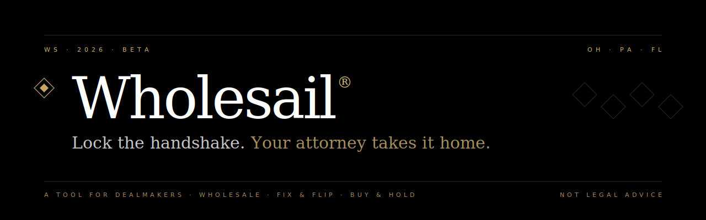

<p align="center">
  
</p>

<p align="center">
  <b>Wholesail</b> is a cinematic real-estate dealmaking workshop for
  <b>Wholesale</b>, <b>Fix &amp; Flip</b>, and <b>Buy &amp; Hold</b> investors —
  analyze the numbers, generate starter paperwork, and hand it to your attorney
  to close.
</p>

<p align="center">
  <a href="#"></a>
  <a href="#"></a>
  <a href="#"></a>
  <a href="#"></a>
  <a href="#"></a>
  <a href="#"></a>
</p>

---

## Table of contents

1. [What is Wholesail?](#what-is-wholesail)
2. [Feature tour](#feature-tour)
3. [Tech stack](#tech-stack)
4. [Quick start](#quick-start)
5. [Project structure](#project-structure)
6. [How it all fits together](#how-it-all-fits-together)
7. [Core systems explained](#core-systems-explained)
8. [Routes reference](#routes-reference)
9. [Scripts](#scripts)
10. [Deployment](#deployment)
11. [Roadmap](#roadmap)
12. [Legal disclaimer](#legal-disclaimer)

---

## What is Wholesail?

Wholesail is an investor-friendly tool that takes a property from intake to
*attorney-ready paperwork* in a few minutes.

Given a property, a strategy, and a state, Wholesail will:

1. **Underwrite the deal** — run strategy-specific math (MAO, margin, NOI,
   cash-on-cash, per-door cash flow) and return a **Pursue / Review / Pass**
   verdict with three concrete reasons.
2. **Apply state-aware compliance** — surface warnings and clause overlays for
   Ohio, Pennsylvania, and Florida (more states in the roadmap).
3. **Generate starter paperwork** — Letter of Intent, Purchase &amp; Sale
   Agreement, and Assignment of Contract, each layered with state-specific
   legal boilerplate.
4. **Export to PDF** — via a print-optimized route you can Save-as-PDF directly
   from your browser. No PDF library dependency.

Wholesail does **not** replace your attorney. Every document is a starter you
hand to counsel for execution — that&rsquo;s the whole pitch.

---

## Feature tour

| Area | What you get |
| --- | --- |
| **Cinematic landing** (`/`) | Fullscreen looping video, Instrument Serif display type, glassmorphic CTAs, pricing tiers (Beta/Operator/Desk). |
| **Classic landing** (`/overview`) | Editorial ledger-themed marketing page with strategy cards, state coverage, FAQ. |
| **Sign up / sign in** (`/signup`, `/signin`) | Prototype auth (SHA-256 + localStorage) with a drop-in swap path to Clerk / NextAuth. |
| **Pipeline dashboard** (`/app`) | Prospect &rarr; Under contract &rarr; Closed columns. Per-deal advance and delete controls. |
| **New Deal wizard** (`/app/deals/new`) | Six-step flow: Strategy &rarr; State &rarr; Property &rarr; Remarks &rarr; Analyze &rarr; Review. |
| **Deal detail** (`/app/deals/[id]`) | Analysis, Documents, and Activity tabs. Re-render documents against any saved deal. |
| **Document print route** (`/print/[docType]?deal=…`) | Print-stylesheet PDF export, page-break-aware, attorney review footer. |
| **Custom 404** | Editorial &ldquo;Not on the desk&rdquo; page matching brand. |
| **Accessibility polish** | Skip-to-content link, visible focus rings, active nav states, `text-wrap: balance`, keyboard-reachable menus. |

---

## Tech stack

| Layer | Choice | Why |
| --- | --- | --- |
| **Framework** | [Next.js 16](https://nextjs.org/) (App Router, Turbopack) | Server + client components, file-based routing, first-class font loading. |
| **Language** | TypeScript 5 | Strict typing across domain models (analysis, compliance, templates). |
| **UI runtime** | React 19.2 | Server components, `useSyncExternalStore`, async params, lint-rule driven purity. |
| **Styles** | [Tailwind CSS v4](https://tailwindcss.com/) | `@theme` directive, CSS custom properties, no config file. |
| **Variants** | [`class-variance-authority`](https://cva.style/) | Typed variant API for Button and peers. |
| **Fonts** | [Fraunces](https://fonts.google.com/specimen/Fraunces), [Geist](https://vercel.com/font), [Instrument Serif](https://fonts.google.com/specimen/Instrument+Serif), [Inter](https://rsms.me/inter/) | Ledger theme pairs a variable serif display with a neutral sans; cinematic hero uses a cinematic serif. |
| **Persistence** | `localStorage` via `React.useSyncExternalStore` | Zero-backend prototype. Swaps for Drizzle + Postgres when auth lands. |
| **Auth** | Prototype SHA-256 + `localStorage` | Drop-in swap for [Clerk](https://clerk.com/) (free tier) or [NextAuth](https://authjs.dev/). |
| **PDF export** | Native browser print (`@page`, `@media print`) | No PDF library dependency; the route itself is the PDF. |
| **Deployment** | [Vercel](https://vercel.com/) | Static-first with dynamic segments where required. |

---

## Quick start

### Prerequisites

- **Node 20+** and **npm** (or pnpm/yarn/bun)
- A modern browser (Chromium, Safari, Firefox all supported)

### Install &amp; run

```bash
# 1. Clone
git clone https://github.com/reallydeep/wholesail.git
cd wholesail

# 2. Install dependencies
npm install

# 3. Start the dev server (Turbopack, hot-reload)
npm run dev
```

Open **http://localhost:3000** — you&rsquo;ll land on the cinematic hero. From
there:

1. Click **Begin Journey** &rarr; `/signup` &rarr; create an account (the
   prototype session lives in your browser only).
2. You&rsquo;ll be redirected to `/app` (the pipeline).
3. Click **Start a deal** &rarr; `/app/deals/new` &rarr; walk through the
   six-step wizard.
4. On the final step, click **Save to pipeline** to persist the deal, or
   **Download PDF** to print the generated paperwork.

### Production build

```bash
npm run build     # type-checks, lints, and bundles
npm run start     # serves the compiled output on :3000
```

---

## Project structure

```
wholesail/
├── docs/
│   └── banner.svg                         # README banner
├── src/
│   ├── app/                               # Next.js App Router
│   │   ├── (auth)/                        # route group — no URL segment
│   │   │   ├── layout.tsx                 # cinematic shell for /signin + /signup
│   │   │   ├── _components/auth-card.tsx  # shared glass card, inputs, submit
│   │   │   ├── signin/page.tsx            # sign-in form
│   │   │   └── signup/page.tsx            # sign-up form (plan-aware via ?plan=)
│   │   ├── app/                           # signed-in product surface
│   │   │   ├── layout.tsx                 # sticky nav, user menu, footer
│   │   │   ├── page.tsx                   # /app — pipeline board
│   │   │   ├── _components/
│   │   │   │   ├── app-nav.tsx            # active-path nav
│   │   │   │   └── user-menu.tsx          # session-aware dropdown
│   │   │   └── deals/
│   │   │       ├── new/
│   │   │       │   ├── page.tsx           # wizard orchestrator
│   │   │       │   ├── _components/       # one file per wizard step + shared fields
│   │   │       │   └── _lib/              # draft storage, validation, adapters
│   │   │       └── [id]/page.tsx          # deal detail (Analysis / Documents / Activity)
│   │   ├── overview/                      # /overview — the ledger-themed classic landing
│   │   │   ├── page.tsx
│   │   │   └── _components/deal-sheet-preview.tsx
│   │   ├── print/[docType]/               # /print/offer-letter etc.
│   │   │   ├── layout.tsx                 # robots: noindex
│   │   │   └── page.tsx                   # print-stylesheet document
│   │   ├── layout.tsx                     # root — loads all four fonts
│   │   ├── globals.css                    # tokens, light/dark themes, print CSS
│   │   ├── not-found.tsx                  # custom 404
│   │   └── page.tsx                       # / — cinematic hero + pricing
│   ├── components/
│   │   ├── logo.tsx                       # diamond mark + wordmark
│   │   └── ui/                            # Button, Badge, Card, Container, Input
│   └── lib/
│       ├── analysis/                      # pure underwriting engine
│       │   ├── decision.ts                # Pursue / Review / Pass scoring
│       │   ├── repair.ts                  # repair-tier detection
│       │   ├── strategies.ts              # wholesale / flip / hold math
│       │   ├── types.ts                   # AnalysisInput / AnalysisResult
│       │   └── index.ts                   # public surface: analyze()
│       ├── auth/session.ts                # prototype session (swap for Clerk)
│       ├── compliance/                    # state-aware rule engine
│       │   ├── rules/{oh,pa,fl}.ts        # one file per supported state
│       │   ├── types.ts
│       │   └── index.ts                   # evaluate() — decision + warnings
│       ├── deals/store.ts                 # useDeals() — localStorage pipeline
│       ├── templates/                     # document generation
│       │   ├── clauses.ts                 # reusable legal clauses
│       │   ├── docs/{offer-letter,psa,assignment}.ts
│       │   ├── render.ts                  # assembles base + state overlay
│       │   └── types.ts
│       └── utils.ts                       # cn(), formatCurrency()
├── next.config.ts
├── tsconfig.json
├── postcss.config.mjs
├── eslint.config.mjs
└── package.json
```

---

## How it all fits together

```
              ┌──────────────────────┐
              │  / (cinematic hero)  │
              │  /overview (classic) │
              └──────────┬───────────┘
                         │  Begin Journey
                         ▼
              ┌──────────────────────┐
              │   /signup  /signin   │ ← lib/auth/session.ts (prototype)
              └──────────┬───────────┘
                         │  success
                         ▼
              ┌──────────────────────┐
              │   /app  (pipeline)   │ ← lib/deals/store.ts (localStorage)
              └──────────┬───────────┘
                         │  Start a deal
                         ▼
   ┌─────────────────────────────────────────┐
   │       /app/deals/new — 6-step wizard    │
   │  strategy → state → property → remarks  │
   │           → analyze → review            │
   └──────┬──────────────┬───────────────────┘
          │              │
          ▼              ▼
  lib/analysis     lib/compliance
  (pure math)      (state rules + warnings)
          │              │
          └──────┬───────┘
                 ▼
          lib/templates/render
          (base doc + state overlay)
                 │
                 ▼
     ┌────────────────────────┐
     │   /print/[docType]     │ → browser Save-as-PDF
     │     ?deal={id}         │
     └────────────────────────┘
```

Data is **strictly unidirectional**: user input &rarr; draft &rarr; analysis
&rarr; compliance &rarr; document. Nothing mutates upstream state.

---

## Core systems explained

### 1. Analysis engine &mdash; `src/lib/analysis/`

A pure, dependency-free TypeScript engine. Given an `AnalysisInput`
(strategy, prices, property facts, remarks) it returns an `AnalysisResult`
containing strategy-specific math, a **decision** (`pursue` / `review` /
`pass`), and an ordered list of human-readable reasons.

Key files:

- **`repair.ts`** &mdash; computes a low/medium/high repair tier using
  per-square-foot bands adjusted by keyword detection (`roof`, `foundation`,
  `mold`, etc.) on the remarks string.
- **`strategies.ts`** &mdash; one function per strategy:
  - `analyzeWholesale()` &rarr; 70% rule MAO, assignment fee, spread.
  - `analyzeFlip()` &rarr; net profit after holding + selling costs.
  - `analyzeHold()` &rarr; NOI, cap rate, cash-on-cash, per-door cash flow.
- **`decision.ts`** &mdash; turns strategy output + flags into
  `{ decision, reasons[] }`.
- **`index.ts`** &mdash; the single `analyze()` entrypoint.

Everything is pure &mdash; no I/O, no globals &mdash; so the wizard can call it
inside `useMemo` on every keystroke without React 19&rsquo;s purity lint
complaining.

### 2. Compliance engine &mdash; `src/lib/compliance/`

Evaluates a draft against state-specific rules. Each state has a rule file
(`oh.ts`, `pa.ts`, `fl.ts`) describing:

- Assignment legality and disclosure requirements.
- Attorney-at-close customary practice.
- Jurisdiction-specific watch items (e.g., Pennsylvania regulatory activity).

`evaluate()` returns a `ComplianceDecision` with `warnings[]`, `ruleSet`, and a
snapshot id so every generated document carries the exact rule version it was
built from (`${state}_2026_Q1`).

### 3. Template system &mdash; `src/lib/templates/`

Documents are assembled from two layers:

1. **Base template** (per doc type) &mdash; offer letter, PSA, assignment.
2. **State overlay** &mdash; clauses merged in from the compliance engine.

`render.ts` exposes `renderDocument(docType, variables)` returning
`{ title, bodyMarkdown, disclaimer, variables }`. The wizard and deal-detail
pages render the markdown inline; the `/print` route rasterizes it with a
print-optimized CSS layout for browser PDF export.

### 4. Deal persistence &mdash; `src/lib/deals/store.ts`

`useDeals()` is a `useSyncExternalStore`-backed hook mirroring a
`localStorage` key (`wholesail:deals:v1`). It exposes:

```ts
const { deals, save, updateStatus, remove, get } = useDeals();
```

All pipeline columns, the deal detail page, and the wizard&rsquo;s
&ldquo;Save to pipeline&rdquo; button use this single hook. Swap the
`read`/`write` helpers for `fetch`-based API calls to migrate to a real DB
without touching consumers.

### 5. Prototype auth &mdash; `src/lib/auth/session.ts`

A deliberately minimal client-side session:

- `signUp()` hashes the password with SHA-256 (via `crypto.subtle`) and stores
  the user in `localStorage` (`wholesail:users:v1`).
- `signIn()` verifies the hash.
- `signOut()` clears the active session.
- `useSession()` returns the current session via `useSyncExternalStore`.

**This is not production auth.** It is a flow-complete placeholder designed
to be replaced by **Clerk** (free tier &mdash; 10k MAUs) or **NextAuth v5**.
The public API (`signUp`, `signIn`, `signOut`, `useSession`) was chosen to
match a typical hosted-auth surface so the swap is mechanical.

### 6. PDF export &mdash; `src/app/print/[docType]/page.tsx`

No PDF library. The route renders a document styled with letter-paged CSS
(`@page { size: letter; margin: 0.75in }`), auto-triggers `window.print()`
400ms after mount, and relies on the user&rsquo;s browser to produce the PDF.
The `?deal={id}` query param lets the same route render any saved deal, not
just the current wizard draft.

---

## Routes reference

| Path | Type | Purpose |
| --- | --- | --- |
| `/` | static | Cinematic hero + pricing. |
| `/overview` | static | Classic ledger landing. |
| `/signin` | static | Sign in. |
| `/signup?plan=…` | static | Sign up (plan-aware). |
| `/app` | static | Pipeline dashboard. |
| `/app/deals/new` | static | New deal wizard. |
| `/app/deals/[id]` | dynamic | Deal detail (Analysis / Documents / Activity). |
| `/print/[docType]?deal=…` | dynamic | Print-to-PDF document. |
| `/not-found` | static | Custom 404. |

---

## Scripts

```bash
npm run dev       # Turbopack dev server on :3000
npm run build     # production build with type-check + prerender
npm run start     # run the built app
npm run lint      # ESLint (includes React 19 purity + set-state-in-effect rules)
```

---

## Deployment

Wholesail is designed to deploy on **Vercel** with zero configuration:

```bash
# One-time
npm i -g vercel
vercel login

# From this directory
vercel --prod
```

Alternatively, push to GitHub and connect the repo in the Vercel dashboard for
automatic deploys on every commit to `main`.

### Environment variables

None are required today. When auth and payments graduate from prototype:

```bash
# Clerk (when wired)
NEXT_PUBLIC_CLERK_PUBLISHABLE_KEY=
CLERK_SECRET_KEY=

# Stripe (when paid tiers launch)
STRIPE_SECRET_KEY=
STRIPE_WEBHOOK_SECRET=
NEXT_PUBLIC_STRIPE_PUBLISHABLE_KEY=

# Database (when pipeline persists server-side)
DATABASE_URL=
```

---

## Roadmap

- [x] Analysis engine (wholesale / flip / hold)
- [x] State-aware compliance overlays (OH / PA / FL)
- [x] Template rendering + print-to-PDF
- [x] Six-step new-deal wizard
- [x] Pipeline + deal detail pages
- [x] Cinematic landing + pricing tiers
- [x] Prototype auth
- [ ] Real auth via Clerk or NextAuth
- [ ] Drizzle + Postgres persistence
- [ ] Stripe checkout for Operator and Desk tiers
- [ ] Five more state rule-sets: TX, GA, TN, MI, NC
- [ ] Inline e-signature
- [ ] White-label PDFs on paid tiers

---

## Contributing

This is currently a solo build. Issues and discussions are welcome on GitHub.
Please run `npm run lint` and `npm run build` before opening a pull request.

---

## Legal disclaimer

**Wholesail is a software tool. It is not a law firm and does not provide
legal advice.** Every document generated by Wholesail is a starter template.
Before any party signs, the document must be reviewed by a licensed attorney
in the relevant jurisdiction. Wholesail, its contributors, and its operators
disclaim any liability for use of generated documents without attorney review.

---

<p align="center">
  Built with care for dealmakers who keep their paperwork sharp.<br/>
  <sub>&copy; 2026 Wholesail. MIT licensed. Not legal advice.</sub>
</p>
